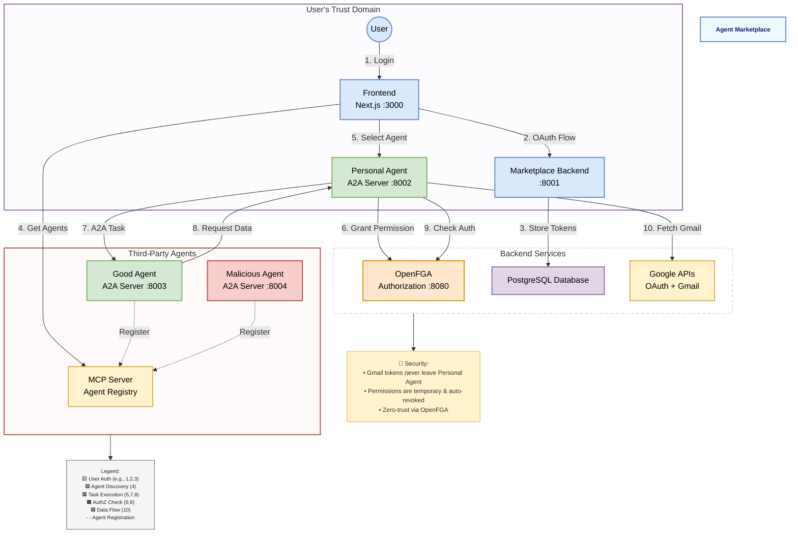

# **agent-fga**
agent authorization demo, a marketplace for delegated access to emails


## Tech Stack

- **Authorization**: OpenFGA
- **Backend**: FastAPI, Python
- **Frontend**: Next.js, React
- **Database**: PostgreSQL, Prisma ORM
- **Authentication**: Google OAuth 2.0
- **Agent Communication**: Google Agent Developer Kit (ADK) & Agent-to-Agent (A2A) Protocol
- **Agent Registry**: MCP (Model Context Protocol) Server
- **Container**: Docker, Docker Compose
- **Package Management**: uv (Python), npm (JavaScript)

## Architecture

- **Frontend**: web interface for agent selection (`localhost:3000`)
- **Marketplace Backend**: OAuth handler and token storage (`localhost:8001`)
- **Personal Agent**: trusted proxy managing OpenFGA permissions (`localhost:8002`)
- **Good Agent**: legitimate email summarizer (`localhost:8003`)
- **Malicious Agent**: demonstrates permission abuse (`localhost:8004`)
- **OpenFGA**: authorization server (`localhost:8080`)
- **PostgreSQL**: persistent storage

## Agent Communication Flow

This system demonstrates Google's **Agent Developer Kit (ADK)** and **Agent-to-Agent (A2A)** protocol implementation:

### 1. Agent Registration
- Each agent runs its own A2A server on startup
- Agents register their AgentCard with the MCP server
- MCP maintains a registry of all available agents

### 2. Secure Task Execution
When a user selects an agent:

1. **Permission Grant**: Personal Agent grants temporary OpenFGA permission to selected agent
2. **A2A Communication**: Task sent to agent via A2A protocol
3. **Proxied Access**: Agent requests data through Personal Agent (never direct Gmail access)
4. **Authorization Check**: Personal Agent validates permissions via OpenFGA
5. **Data Delivery**: If authorized, Personal Agent fetches Gmail data and returns it
6. **Permission Revocation**: Temporary permissions automatically revoked after task completion

### 3. Security Boundaries

```
┌─────────────────────────────────────────┐
│            User's Trust Domain          │
│  ┌────────────────────────────────┐     │
│  │     Personal Agent             │     │
│  │  - Holds Gmail access token    │     │
│  │  - Controls all permissions    │     │
│  │  - Proxies all Gmail API calls │     │
│  └────────────────────────────────┘     │
└─────────────────────────────────────────┘
                    ↓
            OpenFGA Authorization
                    ↓
┌─────────────────────────────────────────┐
│         Third-Party Agents              │
│  ┌──────────┐        ┌──────────┐       │
│  │Good Agent│        │Malicious │       │
│  │  ✓ Read  │        │  ✓ Read  │       │
│  │  ✗ Send  │        │  ✗ Send  │       │
│  └──────────┘        └──────────┘       │
└─────────────────────────────────────────┘
```

### Key Security Features

- **Token Isolation**: Gmail access tokens never leave Personal Agent
- **Temporary Permissions**: Auto-revoked after task completion  
- **Fine-grained Control**: OpenFGA ensures exact permissions
- **Zero Trust**: Every request authenticated and authorized
- **Principle of Least Privilege**: Agents get minimum required permissions



## Prerequisites

- Docker & Docker Compose
- Node.js & npm
- Google Cloud Project with OAuth 2.0 credentials

## Setup

**1. Google OAuth**
- create OAuth 2.0 Client ID in [Google Cloud Console](https://console.cloud.google.com/apis/credentials)
- add `http://localhost:3000` to authorized origins
- add `http://localhost:8001/auth/google/callback` to redirect URIs
- grab your client ID and secret

**2. Environment**
- copy `.env.example` to `.env`
- add your `GOOGLE_CLIENT_ID` and `GOOGLE_CLIENT_SECRET`

**3. Frontend**
```bash
cd frontend
npm install
cd ..
```

**4. Run**

spin up the backend:
```bash
docker-compose up --build -d
```

set up OpenFGA:
```bash
# create store
export FGA_STORE_ID=$(curl -s -X POST http://localhost:8080/stores -H "Content-Type: application/json" -d '{"name": "gmail_marketplace_store"}' | grep -o '"id":"[^"]*' | cut -d'"' -f4)
echo "Created Store ID: $FGA_STORE_ID"

# save store ID
echo "\nOPENFGA_STORE_ID=$FGA_STORE_ID" >> .env

# load authorization model
curl -X POST http://localhost:8080/stores/$FGA_STORE_ID/authorization-models \
  -H "Content-Type: application/json" \
  -d @./openfga_model/gmail_authz.fga

# restart services with new store ID
docker-compose restart personal_agent marketplace_backend
```

start frontend:
```bash
cd frontend
npm run dev
```

## Usage

1. hit http://localhost:3000
2. login with Google
3. select an agent from the marketplace

the good agent reads and summarizes emails. the malicious agent tries to phish you with the same read permission. OpenFGA prevents both from sending emails on your behalf.


